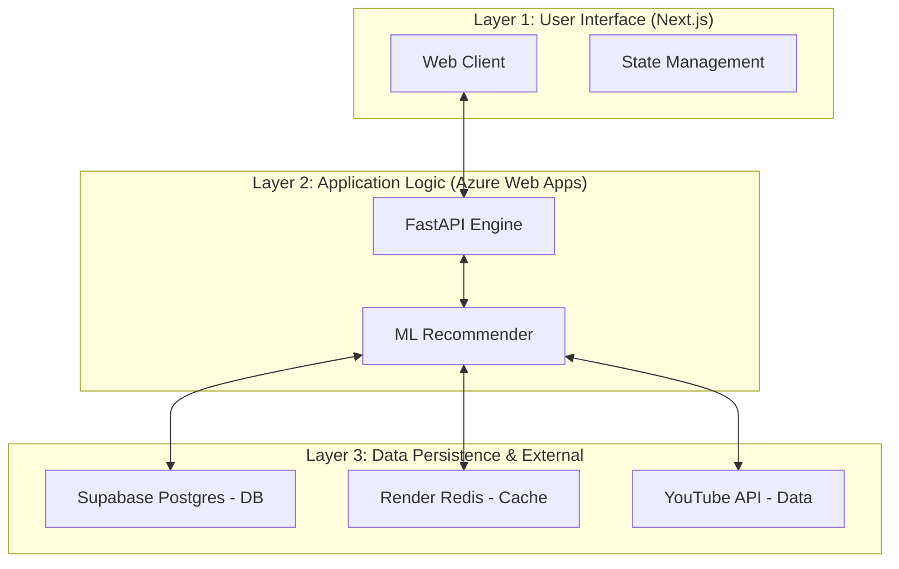

# TuneSwipe 

## Discover Your Next Obsession, One Swipe at a Time

Tired of the same old playlists on repeat? Wish you could discover new music that perfectly matches your vibe, right now? **Welcome to TuneSwipe.**

TuneSwipe is a fresh, interactive way to find your next favorite song. We've thrown out the boring algorithms and put you in control. Using a fun, Tinder-style swiping interface, you become the DJ of your own discovery journey.

---

## Features That Rock

- **Mood Check**
  Tell us what you're feeling. Whether you need "Chill" "Indie" tracks for a study session or "Energetic" "Rap" for a workout, select your mood and genre, and we'll curate a list of potential bangers just for you.

- **AI-Powered Recommendations **
  As you like songs, our AI-powered Python backend learns your taste and suggests new tracks that you're likely to love, keeping the discoveries fresh and relevant.

- **Swipe, Listen, Repeat **
  Dive into a stack of song cards, each featuring album art and artist info.
  - **SWIPE RIGHT** to like a song and add it to your personal collection.
  - **SWIPE LEFT** to skip and move on to the next discovery.

- **Instant Previews, Powered by YouTube **
  Hear something you like? Just click on the card to get an instant preview directly from YouTube. No more guessing—know if it's a hit before you commit.

- **Your Personal Mixtape **
  Every song you swipe right on is saved to your "Liked Songs" list. When you're done, you can easily download your new mixtape as a simple text file, ready to be added to your favorite streaming service.

---

## Tech Stack

TuneSwipe is a modern, full-stack web application built with a powerful and fast tech stack, combining a sleek frontend with an intelligent backend.

### Frontend
- **Framework**: **[Next.js](https://nextjs.org/)** (React) for a fast, server-rendered user experience.
- **Language**: **[TypeScript](https://www.typescriptlang.org/)** for robust, type-safe code.
- **Styling**: **[Tailwind CSS](https://tailwindcss.com/)** for a utility-first styling workflow.
- **UI Components**: **[ShadCN UI](https://ui.shadcn.com/)** for a beautiful, accessible, and modern component library.

### Backend & Infrastructure
- **Hosting**: **[Azure Web Apps](https://azure.microsoft.com/en-us/products/app-service/web/)** for hosting the Python FastAPI microservice.
- **AI Recommendations**: A **[Python](https://www.python.org/)** microservice built with **[FastAPI](https://fastapi.tiangolo.com/)** that leverages machine learning for personalized music discovery.
- **Database**: **[PostgreSQL](https://www.postgresql.org/)** (hosted on **Supabase/AWS**) for robust, scalable user data and preference persistence.
- **Caching**: **[Redis](https://redis.io/)** (hosted on **Render**) for high-performance response caching and sub-200ms latency.
- **Music Data Source**: **[YouTube Data API](https://developers.google.com/youtube/v3)** to source an endless stream of music for discovery.

---

## Architecture

TuneTrace 2.0 uses a modern 3-layered architecture for maximum performance and scalability:



---

## Key Achievements

- **Hybrid Recommendation Engine**: Designed a sophisticated engine combining collaborative filtering with content-based algorithms (TF-IDF & Cosine Similarity), as detailed in the technical [whitepaper](file:///c:/Users/Agrannya%20Singh/.antigravity/TuneTrace_Backend/Tune_Trace_backend/tunetrace_report.tex).
- **High Performance**: Achieved sub-200ms database latency by leveraging **Redis caching** and optimizing SQLAlchemy ORM queries.
- **Production Migration**: Successfully migrated from SQLite/Render to a enterprise-grade stack on **Azure Web Apps** with a **PostgreSQL** backend.
- **Scalable Discovery**: Built a robust fallback mechanism ensuring discovery even when cold-starting new user profiles.
- **Cloud Infrastructure**: Orchestrated a multi-cloud setup utilizing Azure for compute, Supabase (AWS) for storage, and Render for caching services.

---

---

## How to Get Started

Ready to run your own TuneSwipe locally? It's easy!

1.  **Clone the repository:**
    ```bash
    git clone https://github.com/Agrannya-Singh/TuneTrace
    ```

2.  **Install dependencies:**
    ```bash
    npm install
    ```

3.  **Set up your environment:**
    Create a `.env` file in the root of the project and add your YouTube API Key:
    ```
    YOUTUBE_API_KEY=your_super_secret_api_key_here
    ```

4.  **Run the development server:**
    ```bash
    npm run dev
    ```

Open [http://localhost:9002](http://localhost:9002) in your browser and start swiping!

---

## Contributing

We welcome contributions to TuneSwipe! If you have an idea for a new feature, a bug fix, or an improvement, please follow these steps:

1.  **Fork the repository.**
2.  **Create a new branch** for your feature or fix (`git checkout -b feature/your-feature-name`).
3.  **Make your changes** and commit them with clear, descriptive messages.
4.  **Push your branch** to your forked repository.
5.  **Open a pull request** to the main repository, detailing the changes you've made.

---

## Reporting Bugs

If you encounter a bug, please help us by reporting it!

- **Search existing issues** to see if someone has already reported the bug.
- If not, **open a new issue**, providing a clear title and a detailed description of the problem. Include steps to reproduce the bug, what you expected to happen, and what actually happened.

---


 
---

## Contact

Have questions or want to connect? Feel free to reach out!

- **Email**: singh.agrannya@gmail.com
